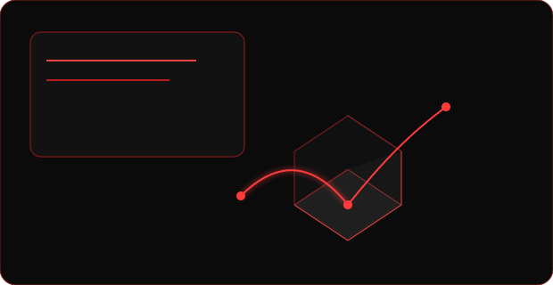
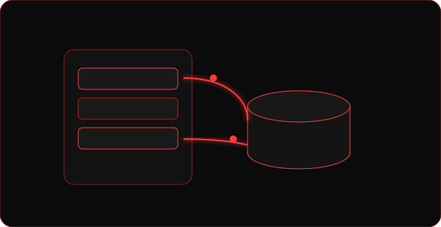
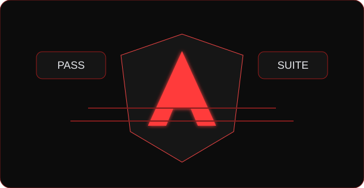
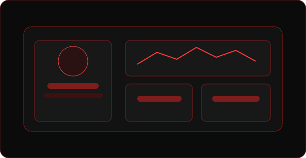
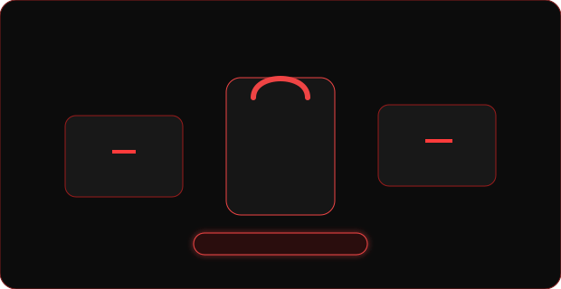
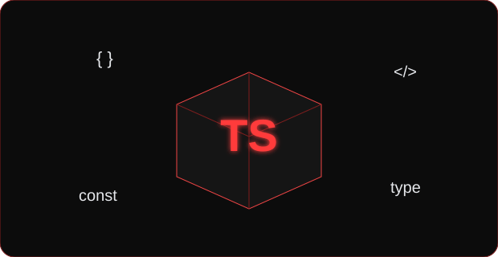

<div align="center">
  

  <a href="https://readme-typing-svg.herokuapp.com?font=Fira+Code&size=22&pause=2200&color=FF3B3B&center=true&vCenter=true&width=900&lines=Frontend+Engineer;Building+scalable+UI+systems;Creating+polished+web+experiences;Turning+product+ideas+into+code">
    
  </a>

  <p>
    <a href="https://asilbek-karomatov.dev"></a>
    <a href="https://linkedin.com/in/asilbek-karomatov-91336b33b"></a>
    <a href="https://t.me/as1lbek_2706"></a>
    <a href="https://github.com/asilbek2706?tab=repositories"></a>
    <a href="mailto:asilbekkaromatov2@gmail.com"></a>
  </p>
</div>

<p align="center"></p>

## About Me

Frontend Engineer focused on building performant, scalable interfaces with clean architecture and practical full-stack integration. I prioritize product quality, maintainable systems, and polished user experience from idea to delivery.

- Strong delivery with **React, Next.js, Angular, and TypeScript**
- Hands-on backend support with **Node.js, Express, PostgreSQL, and Python**
- Product-minded engineering with attention to **UX, reliability, and maintainability**

<p align="center"></p>

## Technology Universe

<p align="center">
  
</p>

<table>
  <tr>
    <td valign="top" width="25%"><strong>Frontend</strong><br/>React<br/>Next.js<br/>Angular<br/>TypeScript<br/>JavaScript</td>
    <td valign="top" width="25%"><strong>Styling</strong><br/>Tailwind CSS<br/>SCSS<br/>Responsive Design<br/>Component Systems</td>
    <td valign="top" width="25%"><strong>Backend</strong><br/>Node.js<br/>Express<br/>Python<br/>REST API</td>
    <td valign="top" width="25%"><strong>Database & Tools</strong><br/>PostgreSQL<br/>Git<br/>GitHub<br/>Docker<br/>Vite</td>
  </tr>
</table>

<p align="center"></p>

## Featured Projects

<table>
  <tr>
    <td width="50%" valign="top">
      
      <h3><a href="https://github.com/asilbek2706/GitZone">GitZone</a></h3>
      <p>A GitHub-inspired development platform built with scalable frontend and backend architecture.</p>
      <p>
        
        
        
        
        
      </p>
      <a href="https://github.com/asilbek2706/GitZone"></a>
    </td>
    <td width="50%" valign="top">
      
      <h3><a href="https://github.com/asilbek2706/backend-learning-project">backend-learning-project</a></h3>
      <p>A backend learning project focused on API architecture, services, and maintainable server structure.</p>
      <p>
        
        
        
      </p>
      <a href="https://github.com/asilbek2706/backend-learning-project"></a>
    </td>
  </tr>
  <tr>
    <td width="50%" valign="top">
      
      <h3><a href="https://github.com/asilbek2706/angular-unit-testing">angular-unit-testing</a></h3>
      <p>Practical Angular unit-testing examples for reliable components and maintainable applications.</p>
      <p>
        
        
        
      </p>
      <a href="https://github.com/asilbek2706/angular-unit-testing"></a>
    </td>
    <td width="50%" valign="top">
      
      <h3><a href="https://github.com/asilbek2706/student-crash-course">student-crash-course</a></h3>
      <p>A student management application with practical UI and full-stack functionality.</p>
      <p>
        
        
        
      </p>
      <a href="https://github.com/asilbek2706/student-crash-course"></a>
    </td>
  </tr>
  <tr>
    <td width="50%" valign="top">
      
      <h3><a href="https://github.com/asilbek2706/asilbek-shop">asilbek-shop</a></h3>
      <p>A responsive shopping experience built around reusable components and polished user flows.</p>
      <p>
        
        
        
      </p>
      <a href="https://github.com/asilbek2706/asilbek-shop"></a>
    </td>
    <td width="50%" valign="top">
      
      <h3><a href="https://github.com/asilbek2706/Sammi-lessons-typescript">Sammi-lessons-typescript</a></h3>
      <p>Hands-on TypeScript lessons and exercises for strengthening core development skills.</p>
      <p>
        
        
      </p>
      <a href="https://github.com/asilbek2706/Sammi-lessons-typescript"></a>
    </td>
  </tr>
</table>

<p align="center"></p>

## Engineering Strengths

- Scalable frontend architecture and reusable component design
- Product-focused delivery with practical business impact
- UI quality with responsive behavior and maintainable structure
- Strong collaboration across frontend and backend boundaries

## Current Focus

- Building robust UI systems in TypeScript ecosystems
- Improving testability, performance, and long-term maintainability
- Translating product ideas into polished production-ready features

<p align="center"></p>

## GitHub Analytics

<p align="center">
  
  
</p>

<p align="center">
  
</p>

<p align="center">
  
</p>

<!-- STATS:START -->
> **Status:** `Analysis Complete`
> 🚀 **Total Stars:** `193`
> 🛠 **Public Projects:** `30`
> 📅 **Last Scan:** `2026-09-24 02:56`
<!-- STATS:END -->

<p align="center"></p>

## Advanced Metrics

<p align="center">
  
</p>

## WakaTime

<!--START_SECTION:waka-->

```txt
From: 17 September 2026 - To: 24 September 2026

Total Time: 0 secs

No activity tracked
```

<!--END_SECTION:waka-->

## Recent Activity

<!--START_SECTION:activity-->
1. 🎉 Merged PR [#3](https://github.com/asilbek2706/OSI-model-visualization/pull/3) in [asilbek2706/OSI-model-visualization](https://github.com/asilbek2706/OSI-model-visualization)
<!--END_SECTION:activity-->

<p align="center"></p>

## Collaboration

Open to collaborating on frontend product development, UI modernization, architecture refactoring, and practical mentorship work.

## Contact

<p align="left">
  <a href="https://asilbek-karomatov.dev"></a>
  <a href="https://linkedin.com/in/asilbek-karomatov-91336b33b"></a>
  <a href="https://t.me/as1lbek_2706"></a>
  <a href="https://github.com/asilbek2706"></a>
  <a href="mailto:asilbekkaromatov2@gmail.com"></a>
</p>

Let’s build high-quality web products together.

## My Old Portfolio
[](https://app.netlify.com/projects/asilbekdev)
