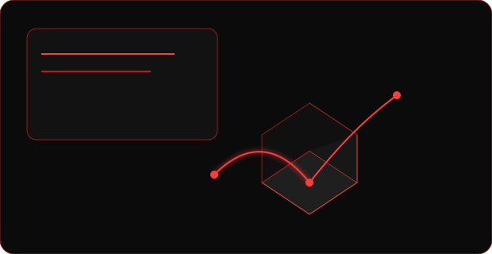
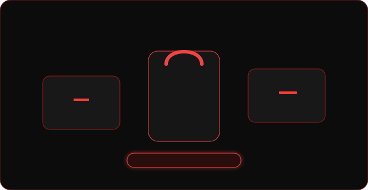
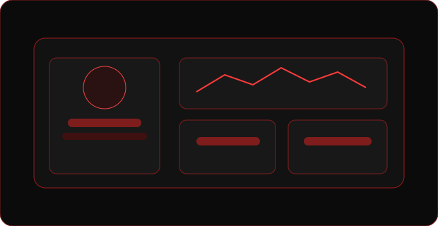
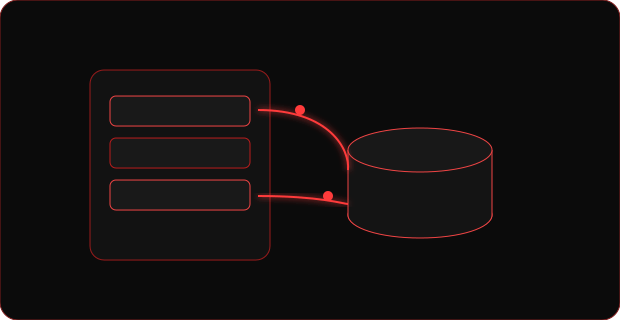
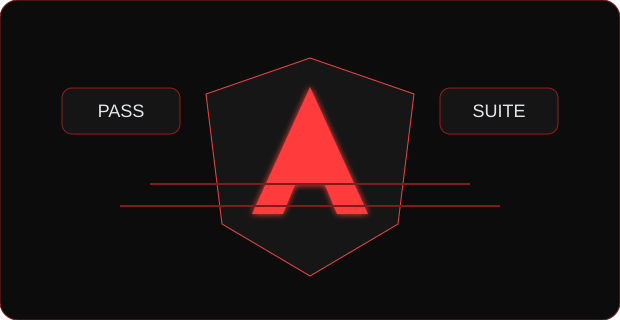
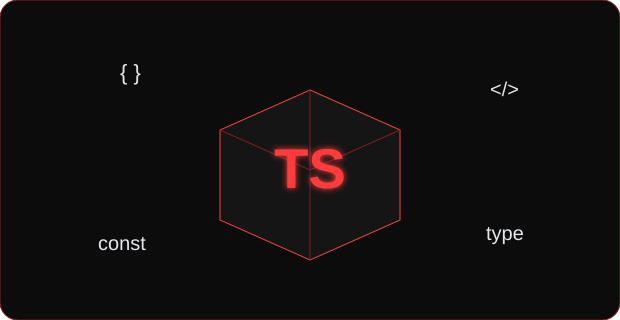

<!-- ═══════════════ HERO ═══════════════ -->
<div align="center">


<a href="https://github.com/asilbek2706">
  
</a>

<br/>

<a href="https://asilbek-karomatov.dev"></a>
<a href="https://linkedin.com/in/asilbek-karomatov-91336b33b"></a>
<a href="https://t.me/as1lbek_2706"></a>
<a href="mailto:asilbekkaromatov2@gmail.com"></a>

<br/><br/>


</div>

<br/>

<div align="center">
  
</div>

<!-- ═══════════════ TERMINAL ABOUT ═══════════════ -->

## `> whoami`

```bash
$ cat asilbek.json
{
  "name": "Asilbek Karomatov",
  "role": "Frontend Engineer",
  "stack": ["React", "Next.js", "Angular", "TypeScript"],
  "backend": ["Node.js", "Express", "PostgreSQL", "Python"],
  "values": ["performance", "clean architecture", "UX that feels fast"],
  "location": "Uzbekistan",
  "currently": {
    "building": "robust UI systems in the TypeScript ecosystem",
    "improving": "testability, performance, maintainability",
    "openTo": "frontend product work, UI modernization, mentorship"
  }
}
```

<br/>

<!-- ═══════════════ TECH ═══════════════ -->

<div align="center">
  <h2>⚡ Tech Universe</h2>

  <h3>Frontend</h3>
  <p>
    
  </p>

  <h3>Styling</h3>
  <p>
    
  </p>

  <h3>Backend</h3>
  <p>
    
  </p>

  <h3>Database & Tools</h3>
  <p>
    
  </p>
</div>

<br />

<!-- ═══════════════ PROJECTS ═══════════════ -->

## 🚀 Featured Projects

<table>
  <tr>
    <td width="50%" valign="top">
      
      <h3><a href="https://github.com/asilbek2706/GitZone">GitZone</a></h3>
      <p>GitHub-inspired development platform with scalable frontend and backend architecture.</p>
      <p>
        
        
        
        
      </p>
      <a href="https://github.com/asilbek2706/GitZone"></a>
    </td>
    <td width="50%" valign="top">
      
      <h3><a href="https://github.com/asilbek2706/asilbek-shop">asilbek-shop</a></h3>
      <p>Responsive shopping experience built on reusable components and polished user flows.</p>
      <p>
        
        
        
      </p>
      <a href="https://github.com/asilbek2706/asilbek-shop"></a>
    </td>
  </tr>
  <tr>
    <td width="50%" valign="top">
      
      <h3><a href="https://github.com/asilbek2706/student-crash-course">student-crash-course</a></h3>
      <p>Student management app with a practical UI and full-stack functionality.</p>
      <p>
        
        
        
      </p>
      <a href="https://github.com/asilbek2706/student-crash-course"></a>
    </td>
    <td width="50%" valign="top">
      
      <h3><a href="https://github.com/asilbek2706/backend-learning-project">backend-learning-project</a></h3>
      <p>API architecture, services and maintainable server structure with Node.js and Express.</p>
      <p>
        
        
        
      </p>
      <a href="https://github.com/asilbek2706/backend-learning-project"></a>
    </td>
  </tr>
</table>

<details>
<summary><b>🧪 Learning & Experiments</b> &nbsp;(click to expand)</summary>
<br/>

<table>
  <tr>
    <td width="50%" valign="top">
      
      <h3><a href="https://github.com/asilbek2706/angular-unit-testing">angular-unit-testing</a></h3>
      <p>Practical Angular unit-testing examples for reliable components.</p>
      <p>
        
        
        
      </p>
    </td>
    <td width="50%" valign="top">
      
      <h3><a href="https://github.com/asilbek2706/Sammi-lessons-typescript">Sammi-lessons-typescript</a></h3>
      <p>Hands-on TypeScript lessons and exercises for core development skills.</p>
      <p>
        
        
      </p>
    </td>
  </tr>
</table>

</details>

<p align="center">
  <a href="https://github.com/asilbek2706?tab=repositories"></a>
</p>

<br/>

<!-- ═══════════════ STRENGTHS ═══════════════ -->

## 🧠 Engineering Strengths

| | |
|---|---|
| 🏗 **Architecture** | Scalable frontend structure and reusable component systems that stay maintainable as products grow |
| 🎯 **Product mindset** | Features shipped with business impact in mind, from idea to production |
| 🎨 **UI quality** | Responsive, accessible and polished interfaces that feel fast |
| 🔗 **Full-stack bridge** | Smooth collaboration across the frontend and backend boundary |
| 🧪 **Reliability** | Testing culture (Angular/Jasmine) and long-term maintainability |

<br/>

<!-- ═══════════════ ANALYTICS ═══════════════ -->

## 📊 GitHub Analytics

<p align="center">
  
  
</p>

<p align="center">
  
</p>

<p align="center">
  
</p>

<p align="center">
  
</p>

<!-- Snake animation: needs the workflow in .github/workflows/snake.yml (see notes) -->
<p align="center">
  <picture>
    <source media="(prefers-color-scheme: dark)" srcset="https://raw.githubusercontent.com/asilbek2706/asilbek2706/output/github-snake-dark.svg" />
    <source media="(prefers-color-scheme: light)" srcset="https://raw.githubusercontent.com/asilbek2706/asilbek2706/output/github-snake.svg" />
    
  </picture>
</p>

<!-- STATS:START -->
> **Status:** `Analysis Complete`
> 🚀 **Total Stars:** `228`
> 🛠 **Public Projects:** `30`
> 📅 **Last Scan:** `2026-10-10 04:06`
<!-- STATS:END -->

<details>
<summary><b>🔬 Advanced Metrics</b></summary>
<br/>
<p align="center">
  
</p>
</details>

<details>
<summary><b>⏱ WakaTime</b></summary>

<!--START_SECTION:waka-->

```txt
From: 02 October 2026 - To: 09 October 2026

Total Time: 0 secs

No activity tracked
```

<!--END_SECTION:waka-->

</details>

<details>
<summary><b>⚡ Recent Activity</b></summary>
<br/>

<!--START_SECTION:activity-->
1. 🎉 Merged PR [#3](https://github.com/asilbek2706/OSI-model-visualization/pull/3) in [asilbek2706/OSI-model-visualization](https://github.com/asilbek2706/OSI-model-visualization)
<!--END_SECTION:activity-->

</details>

<br/>

<!-- ═══════════════ COLLAB + CONTACT ═══════════════ -->

## 🤝 Let's Collaborate

Open to **frontend product development**, **UI modernization**, **architecture refactoring** and **practical mentorship**.

<div align="center">

<a href="https://asilbek-karomatov.dev"></a>
<a href="https://linkedin.com/in/asilbek-karomatov-91336b33b"></a>
<a href="https://t.me/as1lbek_2706"></a>
<a href="mailto:asilbekkaromatov2@gmail.com"></a>

<br/><br/>


<br/>

<sub>Previous version: <a href="https://app.netlify.com/projects/asilbekdev">My Old Portfolio</a></sub>


</div>
